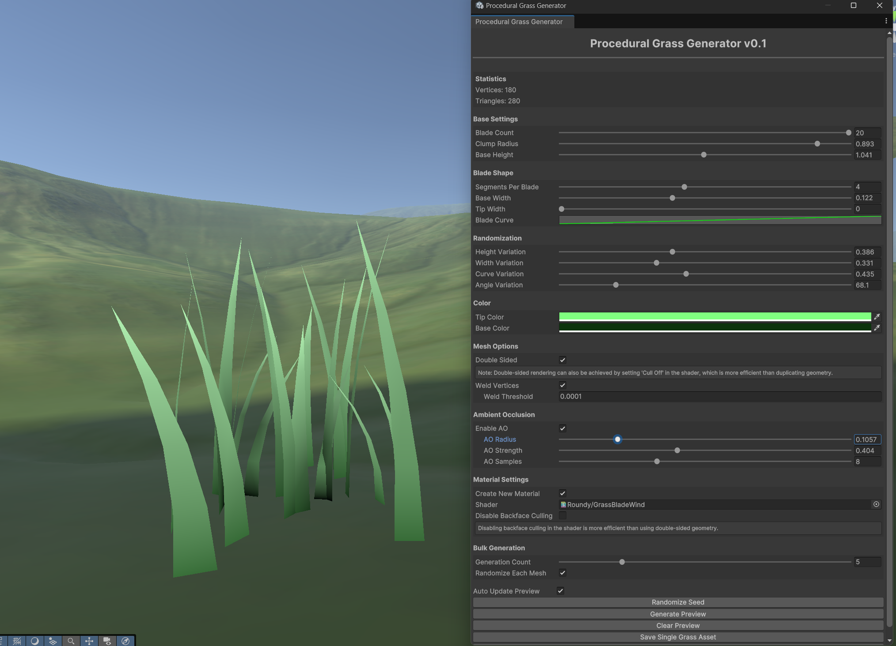

# Stylized Procedural Grass Generator for Unity


A powerful and intuitive tool for generating customizable stylized grass meshes directly in the Unity Editor. Create beautiful, stylized grass with complete control over blade shape, distribution, and appearance. Perfect for games with stylized aesthetics, low-poly environments, and custom art directions.

[https://github.com/roundyyy/ProceduralGrassGenerator/demo.mp4](demo.gif)

## Features
- Real-time preview and generation
- Highly customizable grass blade parameters for stylized looks
- Built-in vertex color support for gradient and AO
- Default grass shader included:
  - Basic wind animation support
  - Vertex color utilization
  - Optional diffuse texture support
  - Adjustable wind parameters
  - Optional backface culling
  - Can be replaced with any custom shader
- Automatic ambient occlusion baked into vertex colors
- Bulk generation capabilities
- Optimized mesh generation with vertex welding
- Support for custom shaders
- Organized asset management
- Built-in randomization system

## Installation
1. Download the latest Unity package from [Releases](https://github.com/roundyyy/ProceduralGrassGenerator/releases)
2. Import the package into your Unity project
3. Access the tool through `Tools > Roundy > Procedural Grass Generator`

## Quick Start
1. Open the Grass Generator window
2. Adjust parameters in real-time with Auto Update enabled
3. Click "Generate Preview" to see your grass mesh
4. Save single assets or generate in bulk
5. Find generated assets in `Assets/GeneratedGrass/`

## Documentation

### Base Settings
- **Blade Count**: Number of grass blades in each clump (1-20)
- **Clump Radius**: Maximum radius of the grass clump distribution (0.01-1.0)
- **Base Height**: Base height of grass blades before variation (0.1-2.0)

### Blade Shape
- **Segments Per Blade**: Number of segments in each blade (1-8)
- **Base Width**: Width at the bottom of each blade (0.01-0.3)
- **Tip Width**: Width at the top of each blade (0-0.3)
  - Set to 0 for sharp, stylized tips
  - Higher values for softer, rounded tips
- **Blade Curve**: Animation curve controlling the blade's bend shape
  - Great for creating characteristic stylized curves

### Randomization
- **Height Variation**: Random variation in blade height (0-1)
- **Width Variation**: Random variation in blade width (0-1)
- **Curve Variation**: Random variation in blade curvature (0-1)
- **Angle Variation**: Random variation in blade rotation (0-360°)

### Color and Materials
- **Tip Color**: Color at the top of grass blades (stored in vertex colors)
- **Base Color**: Color at the bottom of grass blades (stored in vertex colors)
- **Vertex Color Gradient**: Automatically generated between base and tip colors
- **Material Options**: 
  - Use the included basic wind shader
  - Apply your own custom shader
  - Support for standard Unity shaders
  - Optional diffuse texture support

### Default Shader Features
- Basic wind animation
- Vertex color support for gradient and AO
- Simple wind parameters:
  - Wind strength
  - Wind speed
- Optional diffuse texture
- Optional backface culling
- Optimized for mobile and desktop platforms

Note: Feel free to replace the default shader with your own custom shader for more advanced effects and better integration with your game's art style.

### Mesh Options
- **Double Sided**: Generate back faces for the grass
- **Weld Vertices**: Merge vertices within a specified distance
- **Weld Threshold**: Maximum distance for vertex welding

### Ambient Occlusion
- **Enable AO**: Toggle ambient occlusion calculation
- **AO Radius**: Radius for occlusion sampling (0.01-0.5)
- **AO Strength**: Intensity of the occlusion effect (0-1)
- **AO Samples**: Number of sample points (4-16)
- AO is baked into vertex colors for optimal performance

### Material Settings
- **Create New Material**: Toggle between new or existing material
- **Shader**: Choose between:
  - Included basic grass shader
  - Your custom shader
  - Standard Unity shaders
- **Disable Backface Culling**: Toggle culling mode in shader
- **Existing Material**: Reference to an existing material
- **Apply Custom Shader**: Freedom to use any shader that supports vertex colors

### Bulk Generation
- **Generation Count**: Number of assets to generate (1-20)
- **Randomize Each Mesh**: Create unique variations for each asset
- **Shared Materials**: Option to share materials across instances

## Best Practices

### Performance Optimization
1. Use lower segment counts when possible
2. Enable vertex welding to reduce vertex count
3. Use shader-based culling instead of double-sided geometry
4. Utilize vertex colors for gradients
5. Balance AO quality with generation speed

### Visual Quality
1. Use the blade curve to create distinctive stylized bends
2. Add sufficient randomization for organic appearance
3. Adjust color gradient for visual depth and style
4. Fine-tune AO for better ground contact shadows
5. Consider using your own custom shader for better integration with your game's style

### Customization Tips
1. Experiment with different shaders for unique effects
2. Try different vertex color interpretations in custom shaders
3. Add your own shader effects like:
   - Custom lighting models
   - Subsurface scattering
   - Advanced wind effects
   - Dynamic snow coverage
   - Interactive effects

## Asset Organization
Generated assets are automatically organized in:
```
Assets/GeneratedGrass/
├── Meshes/      # Individual grass mesh assets
├── Materials/   # Generated materials
├── Shaders/     # Included basic grass shader
└── Prefabs/     # Ready-to-use grass prefabs
```

## Requirements
- Unity 2020.3 or higher
- Universal Render Pipeline (URP) or Built-in Render Pipeline

## License
This project is licensed under the MIT License - see the [LICENSE](LICENSE) file for details.

## Support
If you encounter any issues or have questions:
1. Check the [Issues](https://github.com/roundyyy/ProceduralGrassGenerator/issues) page
2. Open a new issue with detailed description
3. Include Unity version and render pipeline information

## Contributing
1. Fork the repository
2. Create a new branch
3. Make your changes
4. Submit a pull request

## Acknowledgments
- Developed by Roundy


## Changelog
### v0.1 (Initial Release)
- Basic grass generation functionality
- Real-time preview system
- Bulk generation capabilities
- Ambient occlusion calculation
- Vertex welding optimization
- Basic wind shader included
- Vertex color support
